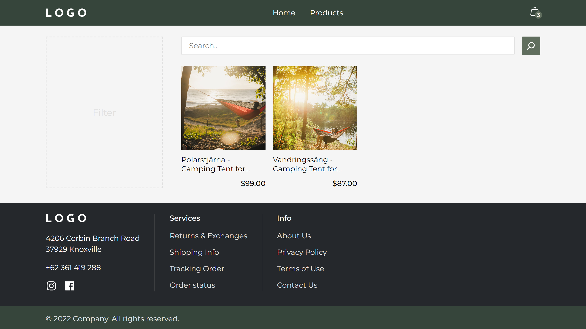
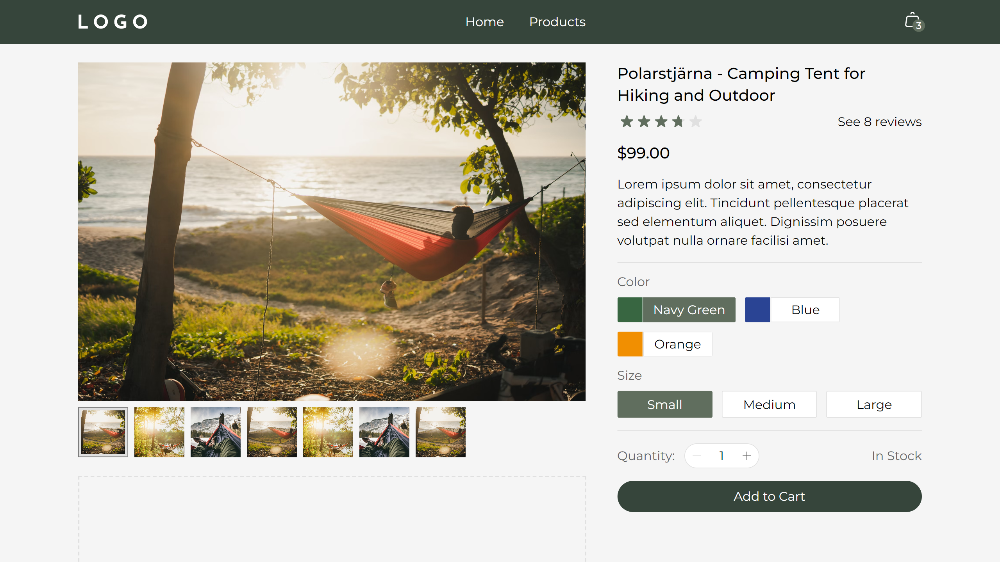
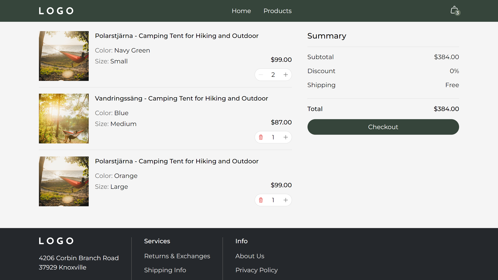

<h1 align="center"> E-Commerce Hiking Website </h1>

An e-commerce hiking website, made with React.

## Links

[Live Demo][link_demo]

## Overview

An e-commerce hiking website, that is made with React front-end framework to demonstrate my coding skills and polish my knowledge in programming. When I started it, I could understand JavaScript on a basic level and used the React library for the first time.

## Screenshots

  
  
  

## Features

- [x] Adding products to the cart
- [x] Removing products from the cart
- [x] Choosing product's color and size
- [x] Fetching data when needed, not every time product ammount have been changed.
- [x] Responsive design

## Used technologies

HTML – Markdown language
 
SCSS – CSS extension language
 
JavaScript – Programming language
 
React – Front-end JavaScript library

## Run locally

### 1. Clone repository

`git clone https://github.com/LiberViator/ecommerce-website`

### 2. Install dependencies

`npm install` or `yarn install`

### 3. Run

`npm start`

## License

Distributed under the MIT License. See [LICENSE.txt][link_license] for more information.

<!-- Links -->

[link_demo]: https://liberviator.github.io/ecommerce-website/
[link_license]: /LICENSE.txt
